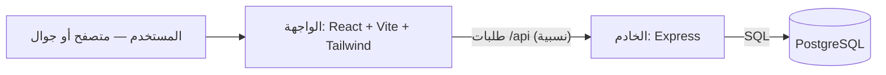

# مشروع تنظيم المضخات

تطبيق عربي (RTL) لإدارة المضخات والدياليات والحصص المائية اليومية، بواجهة موبايل أولًا — دفتر شخصي للمساهم، ولوحة تشغيل كاملة لصاحب المضخة، ولوحة مستقلة لمسؤول النظام.

> **الحالة:** المرحلة الثانية مكتملة — بيانات التشغيل والحسابات صارت على الخادم مع قاعدة بيانات PostgreSQL، والواجهة تصل إليها عبر مسار نسبي واحد `/api`. التفاصيل الكاملة في [`docs/phase2-backend-migration.md`](docs/phase2-backend-migration.md).

---

## البنية



خدمتان فقط: الواجهة (موقع ثابت بعد البناء) والخادم (API)، وكلاهما يتشارك نفس الأصل — لذلك `/api` يعمل في المعاينة وفي النشر دون أي تعديل أو رابط مكتوب في الكود.

---

## أوضاع الاستخدام

| الوضع | لمن | المدخل |
|---|---|---|
| **الوضع المحلي** | تجربة سريعة بلا حساب (الباب الأمامي للتطبيق) | الشاشة الأولى مباشرة |
| **حساب حقيقي** | صاحب المضخة (مالك/مدير) أو المساهم | زر الدخول بالحساب في الشريط العلوي |
| **لوحة مسؤول النظام** | من يدير المستخدمين والمضخات والعضويات | تُفتح من داخل التطبيق لحساب مسؤول |

---

## المزايا

**وضع المالك / المدير**
- إعدادات المضخة التشغيلية: البئر، المزرعة، المحرك، الطاقة، ساعات التشغيل، سعر الديزل، الرواسة، وحدة الحصة والعملة.
- الديالات: الرقم، البداية، عدد الأيام، الحالة، وتثبيت كشف الدوام أو إعادة فتحه.
- كشف الدوام الأساسي (نصيب بالدقائق لكل عضو) منفصل تمامًا عن **الدوام الفعلي** لكل يوم.
- الدوام الفعلي اليومي، الاستخدام، الوقود (ساعات/لتر/ساعة/النقص/السعر)، الرواسة/المشغّل، التوقفات (عطل، مطر، وقود، طارئ…).
- المالية: الدفعات، الديون، الحركات والتكاليف، مع لقطات (snapshot) للأسعار وقت كل عملية.
- الناس والمساهمون، التقارير، وسجل تدقيق لكل عملية حساسة.

**وضع المساهم**
- دفتر شخصي لعدة مضخات: الدورات، الأدوار، توزيع الحصص اليومية بالدقائق والساعات، الوقود والرواسة، والتقارير.
- سجلات شخصية خاصة لا تختلط ببيانات المضخة الرسمية.
- مزامنة رسمية للبيانات المعتمدة من صاحب المضخة.

**لوحة مسؤول النظام**
- المستخدمون (تعيين، إعادة كلمة المرور، كشف الهاتف بصلاحية)، المضخات، العضويات والطلبات، سجل التدقيق، وإعدادات عامة للتطبيق.

**عام**
- عربي كامل مع RTL، تصميم أخضر/أبيض بسيط، وإدخال أرقام موحّد في كل الحقول.
- يعمل دون اتصال ويمكن تثبيته كتطبيق (PWA).
- **المصادقة والتصريح على الخادم** — لا في الواجهة.

---

## التقنيات

| الطبقة | المستخدم |
|---|---|
| الواجهة | React 19 · Vite 6 · TypeScript 5.8 · Tailwind CSS 4 · lucide-react · vite-plugin-pwa |
| الخادم | Node.js ≥ 20 · Express 4.21 · pg 8.13 |
| قاعدة البيانات | PostgreSQL |

التبعيات مثبَّتة بإصدارات محددة، والاستيراد لا يعتمد على أي رابط خادم مكتوب في الكود.

---

## هيكل المشروع

```
src/
  admin/        لوحة مسؤول النظام (المستخدمون، المضخات، العضويات، التدقيق، الإعدادات)
  manager/      وضع المالك/المدير (الديالات، الدوام، المالية، الناس، التقارير)
  shareholder/  وضع المساهم (الدورات، الأدوار، الحسابات، السجلات الشخصية)
  domain/       النموذج والمنطق والقواعد والترحيل والمزامنة
  auth/ lib/    جلسة الوضع المحلي وعميل الـ API
  components/ screens/  عناصر الواجهة المشتركة وشاشات الدخول
server/
  src/index.js  نقطة تشغيل الـ API
  src/db.js     اتصال PostgreSQL + المخطّط (كل الجداول بـ IF NOT EXISTS)
  src/routes/   auth · pumps · operating · admin
  src/          الحُرّاس، الأمان، التدقيق، الإعدادات، bootstrap
scripts/        توليد الأيقونات وفحوصات الحسابات والـ API
docs/           توثيق المرحلة الثانية ومراجعة جاهزية أندرويد
Dockerfile      نشر الخادم (node:20-alpine)
```

---

## التشغيل محليًا

**المتطلبات:** Node.js ≥ 20، وقاعدة PostgreSQL (رابط اتصال).

**1) الواجهة**

```bash
npm install
npm run dev          # يفتح Vite على المنفذ 5173، ويحوّل /api تلقائيًا إلى الخادم
```

**2) الخادم (طرفية ثانية)**

```bash
cd server
npm install
DATABASE_URL="postgresql://..." PORT=3001 node src/index.js
```

عند الإقلاع ينشئ الخادم الجداول الناقصة تلقائيًا (`IF NOT EXISTS`) — **لا يُحذف أي جدول أو عمود ولا تُفقد بيانات**، ثم يصبح جاهزًا على `/api`.

**متغيرات البيئة:** `DATABASE_URL` (مطلوب) و`PORT` (اختياري، الافتراضي 3001). لا تُكتب أي أسرار في الكود أو في المستودع.

**فحوصات سريعة:**

```bash
npm run verify                          # فحص منطق الحسابات (بلا خادم)
node scripts/verify-phase2-api.mjs      # فحص المرحلة الثانية (يحتاج الخادم يعمل)
curl http://localhost:3001/api/health   # {"ok":true,"service":"pump-api"}
```

---

## البناء والنشر

| الخدمة | البناء | الناتج |
|---|---|---|
| الواجهة | `npm run build` | مجلد `dist` (موقع ثابت + PWA) |
| الخادم | `Dockerfile` | صورة Node تشغّل `server/src/index.js` على المنفذ 3001 |

الواجهة تصل إلى خادمها عبر `/api` من نفس الأصل، فيكفي نشر الخدمتين معًا دون ضبط أي رابط.

---

## التوثيق

- [`docs/phase2-backend-migration.md`](docs/phase2-backend-migration.md) — جداول قاعدة البيانات، نقاط الـ API الجديدة، والصلاحيات.
- [`docs/android-audit.md`](docs/android-audit.md) — مراجعة الجاهزية لأندرويد.

---

## المطوّر

برمجة المهندس / عبدالملك عامر
